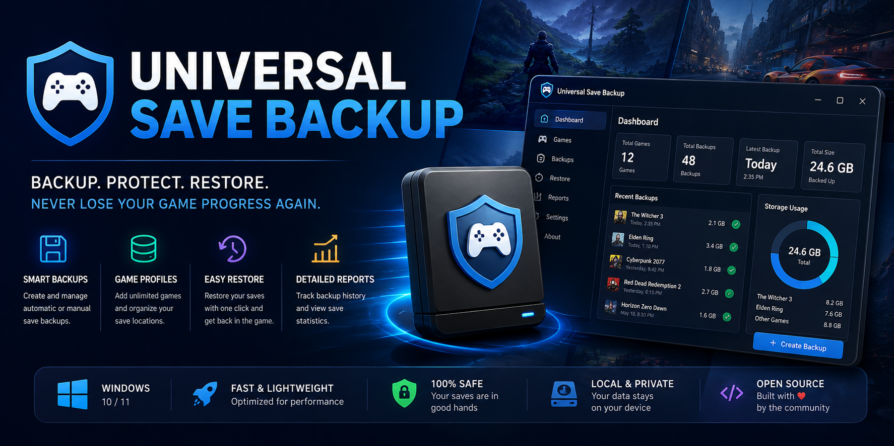
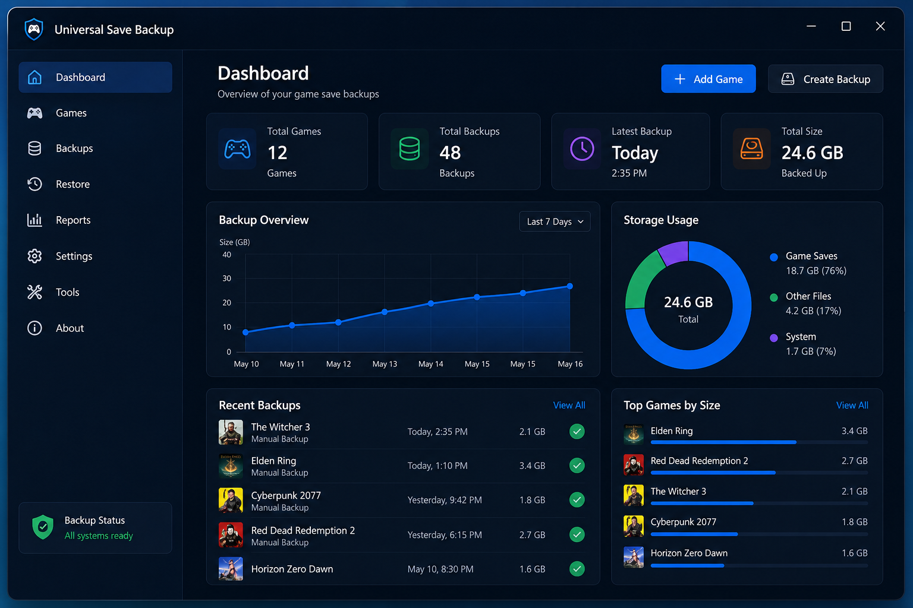
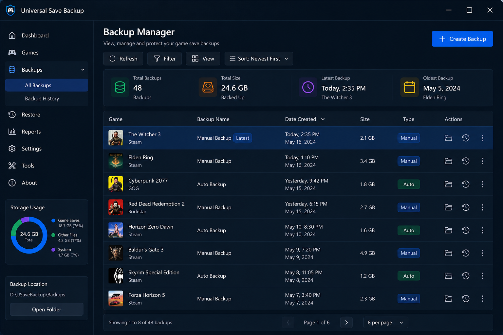

# Universal-Save-Backup
Game save backup and restore utility for Windows. Create backups, manage save profiles, and recover game progress with a simple desktop interface

# Universal Save Backup

  

  Backup and restore game saves in seconds.

  
  
  
  

---

## Overview

Universal Save Backup is a lightweight desktop application that helps players create, manage, and restore backups of game save files.

Never lose progress due to corrupted saves, accidental deletions, or system reinstalls.

---

## Features

### Backup Management

* Create save backups
* Multiple backup profiles
* Backup history
* Restore previous versions

### Game Profiles

* Custom game entries
* Manual save locations
* Organized backup storage

### Restore System

* One-click restore
* Backup validation
* Version tracking

### Reports

* Backup summaries
* Save statistics
* Export reports

---

## Screenshots

### Main Dashboard

### Backup Manager

---

## Installation

1. Download the latest release.
2. Extract the ZIP archive.
3. Launch UniversalSaveBackup.exe.
4. Add your game save folder.
5. Create your first backup.

---

## Roadmap

### v1.1

* Scheduled backups
* Cloud export

### v1.2

* Compression support
* Backup encryption

### v2.0

* Steam Library detection
* Save synchronization

---

## License

MIT License
